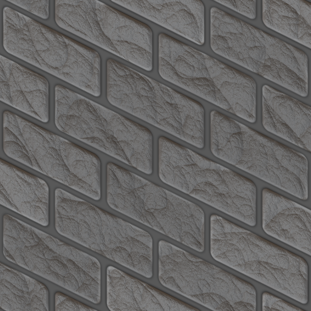
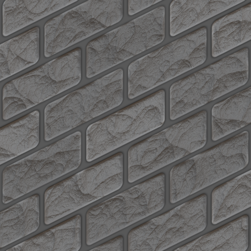

Mainly the knowlege from [screamingbrainstudios](https://screamingbrainstudios.com/making-isometric-tiles/).

They made a tool [texture-manipulator](https://screamingbrainstudios.itch.io/texture-manipulator) quicky do this.

[GMIC](https://gmic.eu/) is a full-featured open-source framework for digital image processing, distributed under the CeCILL free software licenses (LGPL-like and/or GPL-compatible).

We use GMIS's filter named **Cartesian Transform** do `pixel operation` on image.

# Result

| Original                                                                 | Rotate 45 Right                                                       | ISO Rotate Right                                                          | Rotate Right Wall                                                              |
| ------------------------------------------------------------------------ | --------------------------------------------------------------------- | ------------------------------------------------------------------------- | ------------------------------------------------------------------------------ |
|  |  |  |  |

| Original                                                                 | Rotate 45 Left                                                       | ISO Rotate Left                                                          | Rotate Left Wall                                                              |
| ------------------------------------------------------------------------ | --------------------------------------------------------------------- | ------------------------------------------------------------------------- | ------------------------------------------------------------------------------ |
|  |  |  |  |
# Start

```sh
brew install gmic
```

# Rotate 45 Right

```sh
gmic images/Bricks_17-512x512-1.png  if '!2' to_a fi repeat '$!' +norm. . f.. "(1+(x-1)+(y-1))" f. "(1+(y-1)-(x-1))" 'a[-2,-1]' c warp.. .,0,1,2,1 rm. mv. 0 done output images/Bricks_17-512x512-1-Rotate-Right.png
```

# ISO Rotate Right

```sh
gmic images/Bricks_17-512x512-1.png  if '!2' to_a fi repeat '$!' +norm. . f.. "(1+(x-1)+(y-1)*2)" f. "(1+(y-1)*2 -(x-1))" 'a[-2,-1]' c warp.. .,0,1,2,1 rm. mv. 0 done output images/Bricks_17-512x512-1-ISO-Rotate-Right.png
```

# Rotate 45 Left

```sh
gmic images/Bricks_17-512x512-1.png  if '!2' to_a fi repeat '$!' +norm. . f.. "(1+(x-1)-(y-1))" f. "(1+(y-1)+(x-1))" 'a[-2,-1]' c warp.. .,0,1,2,1 rm. mv. 0 done output images/Bricks_17-512x512-1-Rotate-Left.png
```

# ISO Rotate Left

```sh
gmic images/Bricks_17-512x512-1.png  if '!2' to_a fi repeat '$!' +norm. . f.. "(1+(x-1)-(y-1)*2)" f. "(1+(y-1)*2+(x-1))" 'a[-2,-1]' c warp.. .,0,1,2,1 rm. mv. 0 done output images/Bricks_17-512x512-1-ISO-Rotate-Left.png
```

# ISO Rotate Left Wall

```sh
gmic images/Bricks_17-512x512-1.png  if '!2' to_a fi repeat '$!' +norm. . f.. "x" f. "y+x/2" 'a[-2,-1]' c warp.. .,0,1,2,1 rm. mv. 0 done output images/Bricks_17-512x512-1-ISO-Rotate-Left-Wall.png
```

# ISO Rotate Right Wall

```sh
gmic images/Bricks_17-512x512-1.png  if '!2' to_a fi repeat '$!' +norm. . f.. "x" f. "y-x/2" 'a[-2,-1]' c warp.. .,0,1,2,1 rm. mv. 0 done output images/Bricks_17-512x512-1-ISO-Rotate-Right-Wall.png
```
